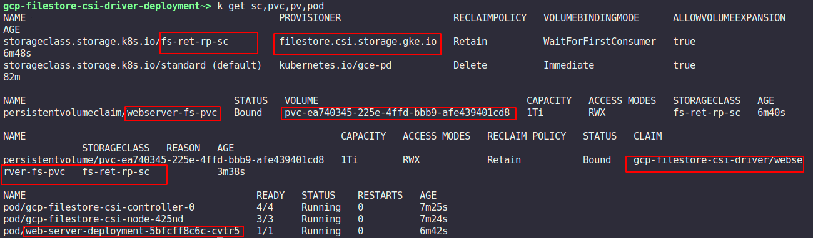
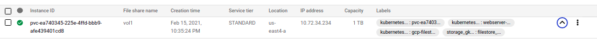

# GCP Filestore CSI driver


This driver allows volumes backed by Google Cloud Filestore instances to be dynamically created and mounted by workloads.
The below deployment has been tested with GKE cluster version `v1.17.15-gke.800`

## Usage

1. Service account creation with the **"Cloud Filestore Editor"** role attached so that fs-csi controller can playaround with the filestore instances.
```
# Variable exports
export PROJECT_ID=`gcloud config get-value core/project`
export SERVICE_ACCOUNT_NAME=gcp-filestore-csi-driver-sa
# service account creation
gcloud iam service-accounts create $SERVICE_ACCOUNT_NAME

# Attaching the Editor Cloud filestore role to the above SA 
gcloud projects add-iam-policy-binding ${PROJECT_ID} \
 --member="serviceAccount:${SERVICE_ACCOUNT_NAME}@${PROJECT_ID}.iam.gserviceaccount.com" \
 --role="roles/roles/file.editor" 
```

2. SA key generation from the above created SA account.
```
# JSON key file creation for the SA
gcloud iam service-accounts keys create --iam-account ${SERVICE_ACCOUNT_NAME}@${PROJECT_ID}.iam.gserviceaccount.com $HOME/gcp_filestore_csi_driver_sa.json
```

3. Kuberenetes secret creation from the "gcp-filestore-csi-driver-sa" SA key which will be used by the "gcp-filestore-csi-driver" pod.
```
# namespace creation
kubectl create ns gcp-filestore-csi-driver
# secret creation from the SA key file
kubectl create secret generic gcp-filestore-csi-driver-sa --from-file=$HOME/gcp_filestore_csi_driver_sa.json -n gcp-filestore-csi-driver
```

4. Deployment of the **"base"** manifest which will deploy the csi controller, driver, provisioner & storage class.
Necessary custom changes(network, tier) can be done within the **"storage class parameters" in the base/sc.yaml.**
```
# base deployment
kubectl apply -k .
```
>Note: make sure kustomization CLI is installed on the system

5. Testing of dynamically provisioning of the filestore instances using the gcp-filestore provisioner
```
# sample webserver deployment consuming the Filestore backed PVC
kubectl apply -k samples/
```

If all works well then the sample nginx webserver will be mounted on the filestore pvc as well as at backend the filestore instance pv   will be created. As shown below in the below console & terminal screenshot




 


## Cleaup
```
kubectl delete -k samples/
kubectl delete -k .
kubectl delete secret gcp-filestore-csi-driver-sa -n gcp-filestore-csi-driver
rm ~/gcp_filestore_csi_driver_sa.json
gcloud iam service-accounts delete ${SERVICE_ACCOUNT_NAME}@${PROJECT_ID}.iam.gserviceaccount.com
```


### Note: If the reclaimPolicy for the storageclass is set "Retain" then the Filestore instances will be retained unless  not deleted manually incurring cost.